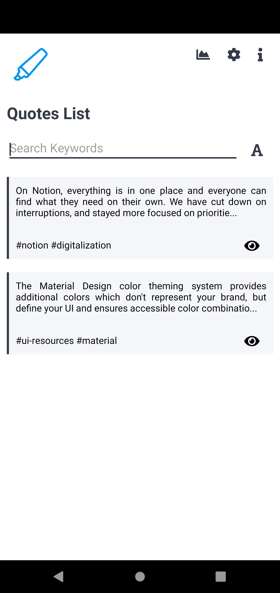
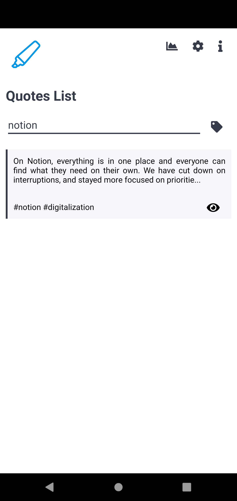
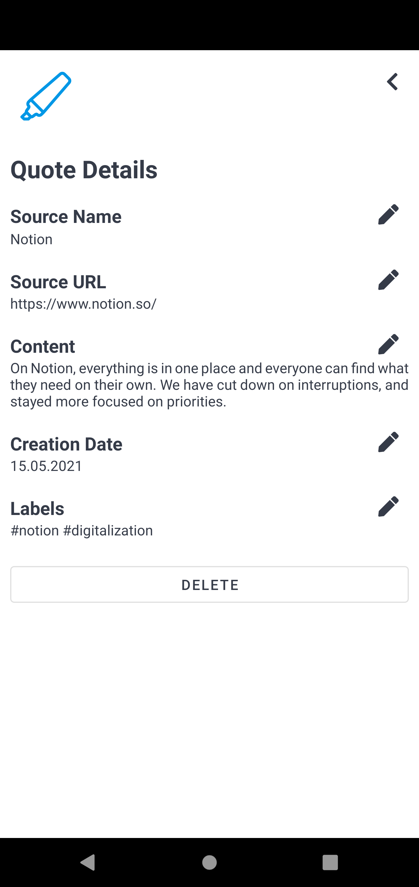
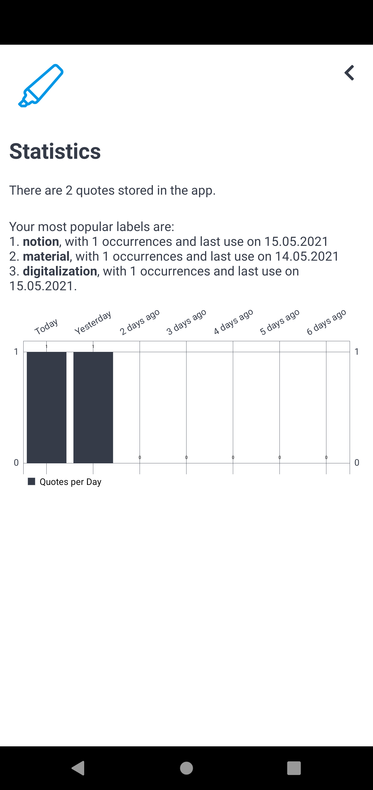
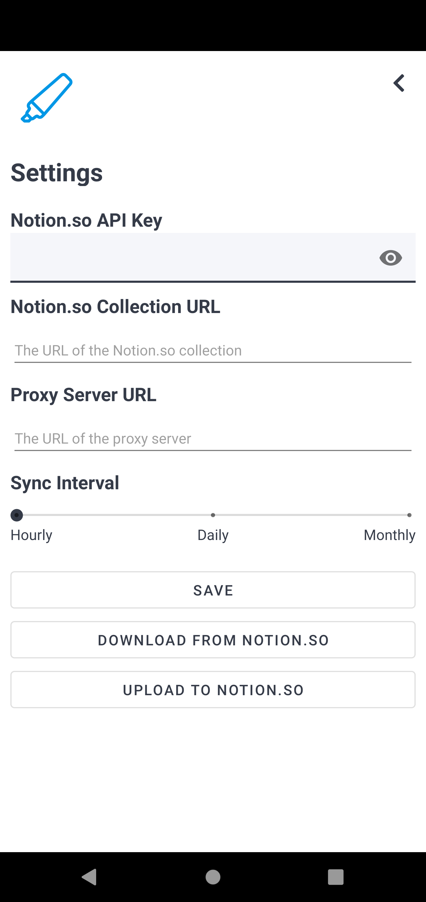
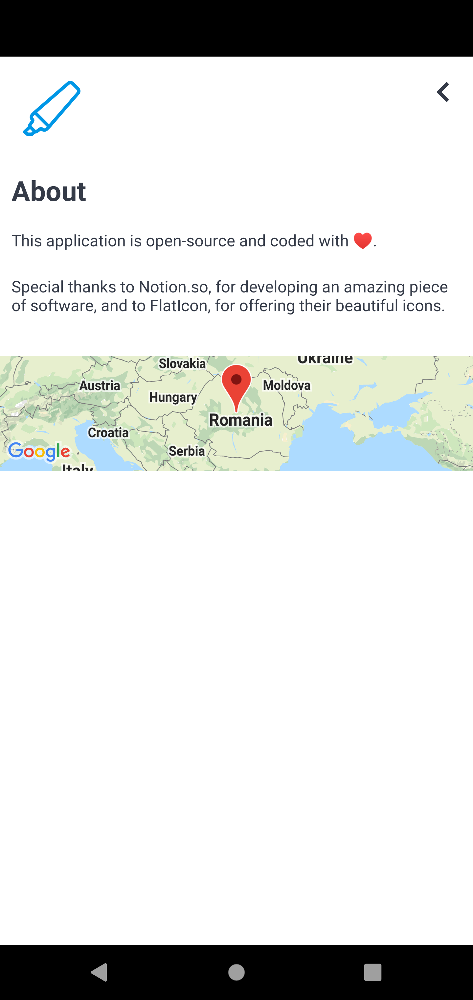
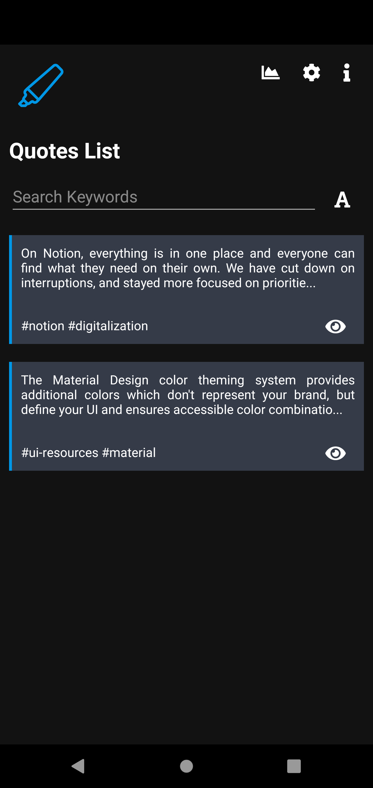

# Highlighter 📱

## Description 🖼️

**Highlighter** is an Android application for gathering texts (referenced in the application context as "*quotes*") from other applications (for example, a sentence from an article read on a website, in the browser), attaching them labels, and saving them locally or in Notion.

The application has the following functionalities:
- saving quotes from other application via the context menu;
- edit of the details of the quote;
- filtering of the quotes by the content or by labels;
- deletion of quotes;
- upload/download of quotes to/from a collection in Notion;
- statistics activity with details about quotes count, the ranking of the used labels, and chart with quotes count per day;
- settings activity;
- activity with details about the application;
- snackbar usage for new events (successes and errors); and
- dark mode.

**Observation**: As the official Notion API was not integrated, the Android application requires a Python 3 proxy server that creates the requests to Notion.

### Screenshots 📸

| Home Activity                                            | Search Functionality                                              | Quote View Activity                                                  | Statistics Activity                                                  | Settings Activity                                                | About Activity                                             | Dark Mode                                                 |
| -------------------------------------------------------- | ----------------------------------------------------------------- | -------------------------------------------------------------------- | -------------------------------------------------------------------- | ---------------------------------------------------------------- | ---------------------------------------------------------- | --------------------------------------------------------- |
|  |  |  |  |  |  |  |

## Setup 🔧

1. Duplicate the Notion [template](https://www.notion.so/01e93bb87e50444ca512b393ab164541?v=d011909e484446c692db2a174583ed53) that will store the quotes
2. Set up `ngrok` by following the [installation guide](https://ngrok.com/download)
3. Set up the proxy server

  ```
  cd api
  pip3 install -r requirements.txt
  python3 api.py
  ngrok http 5000
  ```

4. Open the Android Studio project
5. Create a `secrets.properties` file in the build file with a `MAPS_API_KEY` key storing the Google Maps API key retrieved from Google Cloud Platform
3. Build the project and deploy the application to your Android phone

## Future Improvements 🔜

- Replacement of the unofficial Notion API with the **[official one](https://developers.notion.com/)**, taking out the need for a proxy server
- Testing and refactoring of the user interface to imply responsiveness on all devices
- Replacement of the `AsyncTalk` class, deprecated in API level 30
- Removal of the Google Maps component

## Resources 📚

| Name                            | Description                                           | Link                                                                             |
| ------------------------------- | ----------------------------------------------------- | -------------------------------------------------------------------------------- |
| **notion-py**                   | unofficial Python API client for Notion               | [repository](https://github.com/jamalex/notion-py)                               |
| **Material Design**             | Material Components for Android                       | [website](https://material.io/develop/android)                                   |
| **MPAndroidChart**              | chart library for Android                             | [repository](https://github.com/PhilJay/MPAndroidChart)                          |
| **Maps SDK**                    | Google Maps SDK for Android                           | [website](https://developers.google.com/maps/documentation/android-sdk/overview) |
| **Android - Font Awesome Icon** | Android library for Font Awesome icons                | [repository](https://github.com/ravi8x/Android-Font-Awesome)                     |
| **Room**                        | Android persistence library on top of SQLite database | [website](https://developer.android.com/jetpack/androidx/releases/room)          |
| **Jackson**                     | JSON parser library for Java                          | [repository](https://github.com/FasterXML/jackson)                               |
| **FlatIcon**                    | icons database                                        | [website](https://www.flaticon.com)                                              |